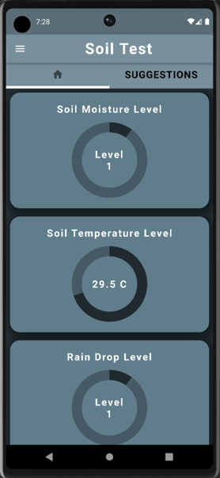
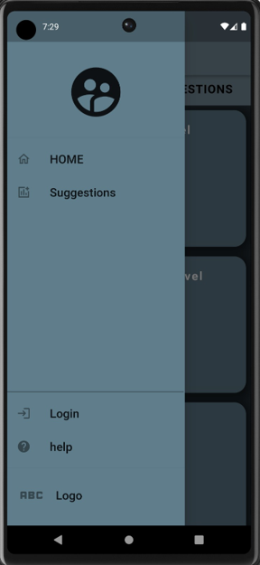

# Soil Test - Flutter Soil Testing Application

A comprehensive Flutter application designed for monitoring soil health and visualizing real-time sensor data. This project leverages Firebase to provide a seamless data flow from sensors to the user's mobile device.

## Key Features

- **Real-time Monitoring**: Track soil parameters live using Firebase Realtime Database.
- **Visual Analytics**: Interactive indicators for easy data interpretation.
- **Secure Authentication**: Integrated Firebase Auth for user management.
- **Dynamic Asset Integration**: Visual cues for different crop types (Banana, Chilli, Tomato, etc.).

## Screenshots

<p align="center">
  
  
</p>

## Tech Stack

- **Framework**: Flutter
- **Backend**: Firebase (Core, Database, Auth)
- **UI Components**: `percent_indicator`, `cupertino_icons`
- **Animations/UX**: `flutter_native_splash`

## Getting Started

To get a local copy up and running, follow these steps:

1.  **Prerequisites**: Ensure you have Flutter SDK installed.
2.  **Clone the Repo**:
    ```bash
    git clone https://github.com/your-repo/soil_test.git
    ```
3.  **Install Dependencies**:
    ```bash
    flutter pub get
    ```
4.  **Run the App**:
    ```bash
    flutter run
    ```
